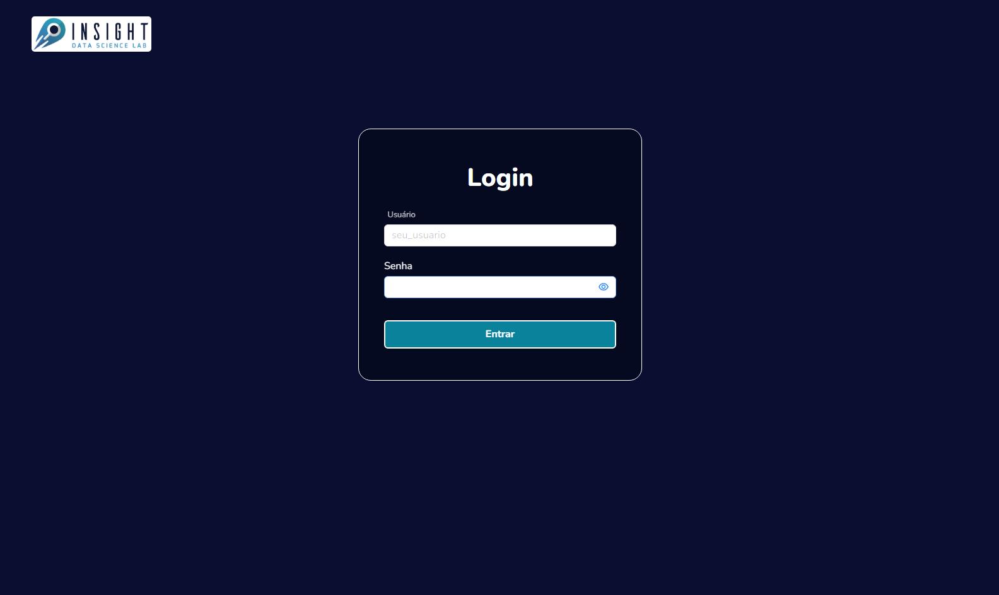
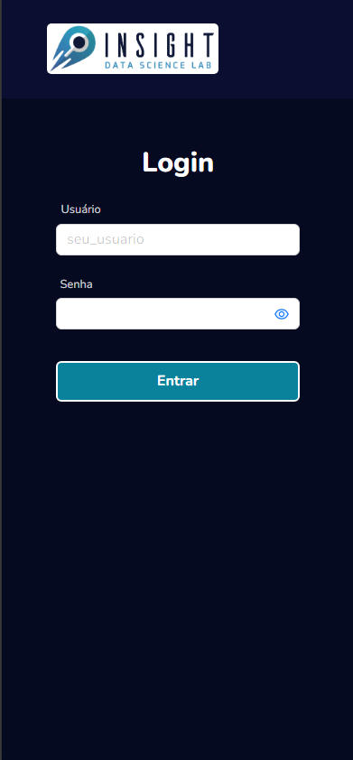
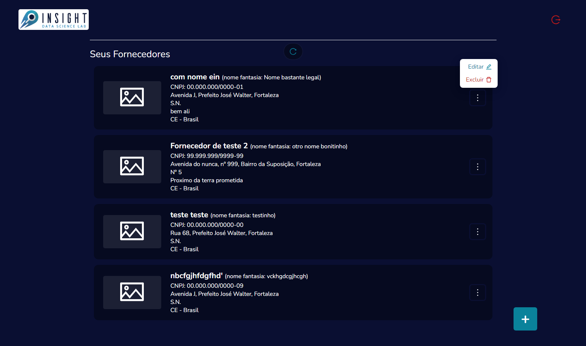
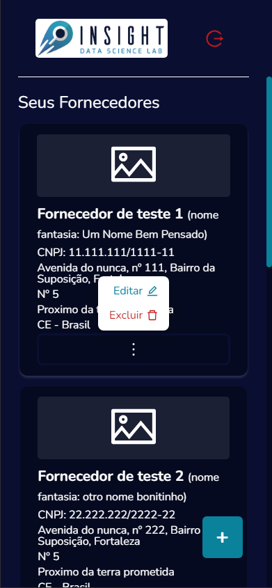
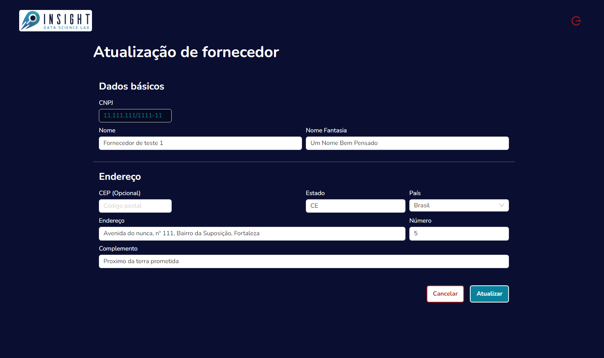
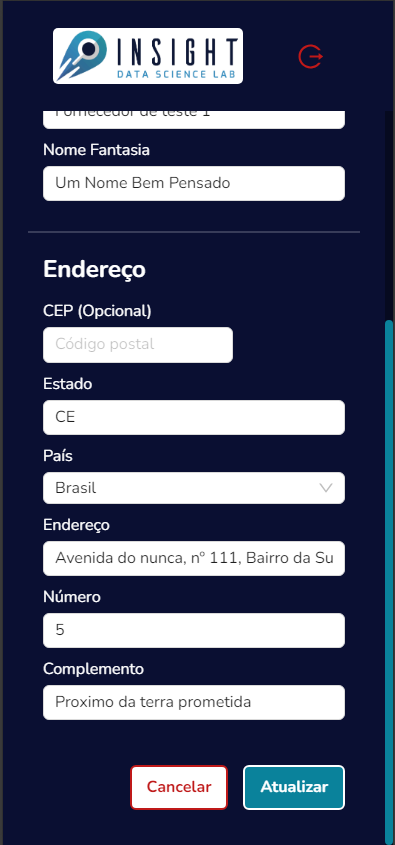

#  Desafio InsgthLab - Fornecedores 

  Minha solução para o desafio da [Insight Lab](https://www.insightlab.ufc.br/)  proposto para submissão à bolsa do "Projeto Cultura".

  A aplicação conta com: sistema de Login, listagem dos fornecedores e cadastro/edição de fornecedores.

#### Credenciais padrão
  Para logar como Administrador:
  - **usuário:** admin
  - **senha:** admin
  
  Para logar como Leitor:
  - **usuário:** user
  - **senha:** user

[Instruções para reproduzir o projeto em sua maquina](#clonar-e-iniciar-o-projeto)

[Projeto lançado na nuvem](#iniciar-o-programa)

## Índice

  * [Tecnologias utilizadas](#tecnologias-utilizadas)
  * [Funcionalidades](#funcionalidades)
    * [Login](#login)
    * [Visualiação dos dados cadastrados](#definição-de-nome)
    * [Cadastro e edição dos Fornecedores](#cadastro-e-edição-dos-fornecedores)
  * [Detalhes Técnicos](#detalhes-técnicos)
    * [Clonar e iniciar o projeto](#clonar-e-iniciar-o-projeto)

## Tecnologias utilizadas

  A aplicação utiliza dados estáticos em um arquivo JSON no diretorio '/src' do projeto, e utiliza o mesmo como base de dados para a manipulação dos objetos utilizados.

 - [
   Typescript
  ](https://www.typescriptlang.org/)
 - [
   React
  ](https://react.dev/) 
 - [
   NextJs
  ](https://nextjs.org/)
 - [
   React Redux
  ](https://react-redux.js.org/)
 - [
   Ant Design
  ](https://ant.design/)
 - [
   Styled Components
  ](https://styled-components.com/)

## Funcionalidades

### Login

<div style="display: flex;justify-content: space-between;">
  
  
</div>

  A aplicação utiliza um sistema de login para o controle de permissoes de usuario no aplicativo (admin: permissão total, user: apenas vizualização dos dados). Utilizando o sistema de Cookies nativo da ferramenta NextJS para persistir os dados de sessão.

  Ao realizar o login, a aplicação é redirecionada para a listagem de Fornecedores

### Visualiação dos dados cadastrados

<div style="display: flex;justify-content: space-between;">
  
  
</div>

### Cadastro e edição dos Fornecedores

<div style="display: flex;justify-content: space-between;">
  
  
</div>

## Detalhes Técnicos

### Clonar e iniciar o projeto

Clone o codigo fonte com o comando:
```bash
git clone https://github.com/jorgejunior618/Projeto-Cultura-Insight.git
```
Com o projeto na sua maquina, instale as dependencias:
```bash
npm i
```
E para iniciar o ambiente de desenvolvimento:
```bash
npm run dev
```
